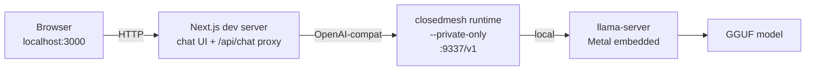
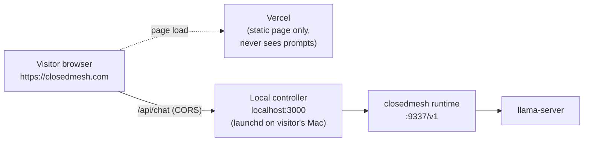

# ClosedMesh

**Private LLM. Your team's hardware.**

ClosedMesh is a chat product for teams who don't want to send their conversations
to a third-party LLM API. The chat UI runs in the browser, the inference runs on
machines you own. Under the hood, ClosedMesh pools the unused capacity of your
team's laptops into a single peer-to-peer inference mesh — no central GPU
cluster, no cloud account, no data leaving the network you control.

This repo contains the ClosedMesh product surface: a Next.js chat app and the
glue that talks to a local runtime node. The runtime itself is a fork of
[Mesh-LLM/mesh-llm](https://github.com/Mesh-LLM/mesh-llm), maintained at
[`closedmesh/closedmesh-llm`](https://github.com/closedmesh/closedmesh-llm) and
shipped as the `closedmesh` binary.

## Architecture



When a teammate joins the mesh from a second Mac, their laptop becomes another
node serving requests for the same chat UI. ClosedMesh routes around offline
machines automatically.

### Public deployment (closedmesh.com → your Mac)

`https://closedmesh.com` is the same Next.js app deployed on Vercel with
`NEXT_PUBLIC_DEPLOYMENT=public`. In that mode, the page can't use Vercel's
serverless `/api/chat` to reach a visitor's local mesh — Vercel's `127.0.0.1`
is its own loopback, not the visitor's. Instead the page calls **back into the
visitor's local controller** at `http://localhost:3000`, which is the same
Next.js bundle running as a launchd service on their Mac. That cross-origin
call works because:

- Browsers permit `https://*` → `http://localhost:*` (localhost is a
  "potentially trustworthy origin", W3C mixed-content spec).
- The local controller adds the right `Access-Control-Allow-Origin` headers
  (see `app/api/_cors.ts`); the allowlist defaults to `https://closedmesh.com`
  and is configurable via `CLOSEDMESH_PUBLIC_ORIGINS`.
- Visitors with no local mesh get a "No local mesh detected" empty state with
  the install command — no half-broken chat UI.



To preview this mode locally, append `?as=public` to a URL (e.g.
`http://127.0.0.1:3000/?as=public` while `localhost:3000` is the controller),
or build with `NEXT_PUBLIC_DEPLOYMENT=public`.

## Run locally

ClosedMesh ships pre-built runtime binaries for several platform/backend
combinations. The installer at `https://closedmesh.com/install` (or
`install.ps1` on Windows) detects your hardware and pulls the right archive.

| OS               | CPU arch  | GPU detected  | Backend selected        |
| ---------------- | --------- | ------------- | ----------------------- |
| macOS            | Apple Silicon | —          | Metal                   |
| Linux            | x86_64    | NVIDIA        | CUDA                    |
| Linux            | x86_64    | AMD (`rocminfo`) | ROCm                 |
| Linux            | x86_64    | Intel / Vulkan-only | Vulkan            |
| Linux            | x86_64    | none          | CPU                     |
| Linux            | aarch64   | Vulkan-capable | Vulkan                 |
| Linux            | aarch64   | none          | CPU                     |
| WSL2             | x86_64    | NVIDIA passthrough | CUDA               |
| Windows 10/11    | x86_64    | NVIDIA        | CUDA                    |
| Windows 10/11    | x86_64    | AMD / Intel / other | Vulkan            |

You can override the auto-detection with `CLOSEDMESH_BACKEND=cuda|rocm|vulkan|cpu`
when running the installer (handy for dual-GPU boxes or unusual setups).

### Quickest path (any supported platform)

```bash
# macOS / Linux / WSL2
curl -fsSL https://closedmesh.com/install | sh

# auto-start at login (writes a launchd plist on macOS, a systemd --user unit
# on Linux, or a Scheduled Task on Windows):
curl -fsSL https://closedmesh.com/install | sh -s -- --service
```

```powershell
# Windows (PowerShell, no admin needed):
iwr -useb https://closedmesh.com/install.ps1 | iex
# auto-start at login (registers a Scheduled Task at login):
iwr -useb https://closedmesh.com/install.ps1 | iex; closedmesh-install -Service
```

Once installed, `closedmesh service start|stop|status|logs` works the same on
all three platforms — it transparently dispatches to launchd, `systemctl --user`,
or `schtasks` depending on which OS you're on.

After the installer finishes, run `closedmesh serve --private-only` (or rely on
the service) and open [http://localhost:3000](http://localhost:3000) for the
chat UI. The status pill in the header shows the number of nodes online plus
the loaded model; hover it for a per-node hardware breakdown (backend, vendor,
VRAM, currently-loaded model). The `/control` page has a Nodes tab with the
same data in tabular form.

The ClosedMesh admin port is [http://localhost:3131](http://localhost:3131) —
useful for inspecting the topology and watching requests as they're served.

### Verify which backend loaded

```bash
curl -s http://localhost:3131/api/status | jq '.capability'
# {
#   "backend": "metal",            # metal | cuda | rocm | vulkan | cpu
#   "vendor": "apple",
#   "vram_total_mb": 16384,
#   "compute_class": "mid",
#   ...
# }
```

`capability.backend` is the source of truth — it's what the rest of the mesh
sees when matching your node to inference requests, and what the status pill
hover panel and `/control` Nodes tab display.

### Building from source (dev / unsupported platform)

The runtime is a fork of [Mesh-LLM/mesh-llm](https://github.com/Mesh-LLM/mesh-llm)
maintained at [`closedmesh/closedmesh-llm`](https://github.com/closedmesh/closedmesh-llm).
Building locally only makes sense if you're hacking on the runtime itself or
running on a platform we don't ship binaries for yet.

```bash
git clone https://github.com/closedmesh/closedmesh-llm.git ../closedmesh-llm
cd ../closedmesh-llm
just build           # ~30 min the first time
./target/release/closedmesh models download Qwen3-0.6B-Q4_K_M  # fast, 397MB
./target/release/closedmesh models download Qwen3-8B-Q4_K_M    # demo model, 5GB
```

### Run the chat app

```bash
# from this directory
npm install
cp .env.example .env.local
./scripts/dev.sh
```

`scripts/dev.sh` starts `closedmesh serve --private-only` if it isn't already
running, then boots the Next.js dev server.

## Add a second machine

The first time `closedmesh serve` runs, it prints an invite token. Anyone with
"reasonable" hardware (a decent GPU, an Apple Silicon Mac, or even a beefy
CPU-only Linux box) can join. The router learns each node's capability and
only dispatches work that node can actually serve.

```bash
# on a Linux/CUDA box, an Apple Silicon Mac, or a Linux/Vulkan laptop:
curl -fsSL https://closedmesh.com/install | sh
closedmesh serve --join <invite-token>
```

```powershell
# on Windows:
iwr -useb https://closedmesh.com/install.ps1 | iex
closedmesh serve --join <invite-token>
```

The new node appears on the first Mac immediately. The chat UI keeps talking
to its local `:9337/v1` endpoint; inference is now load-balanced across every
capability-matched node. CPU-only nodes auto-exclude themselves from large
GPU-class requests via the capability filter, and the chat UI shows a
`reason_code: no_capable_node` 503 if you ask the mesh to run a model nobody
can actually load.

A 70B-class request only routes to nodes that advertise enough VRAM; an 8B
model happily hops between an M-series Mac, an RTX 4090 box, and a Vulkan
laptop in the same conversation.

## Project layout

```
app/                 — Next.js App Router pages and API routes
  api/_cors.ts       — cross-origin policy for /api/chat and /api/status
  api/chat/          — OpenAI-compatible streaming proxy to the ClosedMesh runtime
  api/status/        — node count + loaded models for the status pill
  api/control/       — start/stop/status/logs control panel routes (same-origin only)
  control/           — local-only /control page
  components/        — minimal UI building blocks (no UI library)
  lib/runtime-target.ts  — same-origin (local) vs absolute-URL (public) routing
  lib/use-mesh-status.ts — status pill / mesh-online polling hook
public/install.sh    — what `closedmesh.com/install` serves
scripts/dev.sh       — one command to bring the whole stack up
.env.example         — copy to .env.local
```

## Configuration

| env var                            | default                      | what it does                       |
| ---------------------------------- | ---------------------------- | ---------------------------------- |
| `CLOSEDMESH_RUNTIME_URL`           | `http://127.0.0.1:9337/v1`   | OpenAI-compat base URL             |
| `CLOSEDMESH_ADMIN_URL`             | `http://127.0.0.1:3131`      | Admin endpoint used for topology   |
| `CLOSEDMESH_MODEL`                 | _(first model from /models)_ | Pin a specific model id            |
| `CLOSEDMESH_BIN`                   | _(auto-detected)_            | Path to the `closedmesh` binary    |
| `NEXT_PUBLIC_DEPLOYMENT`           | _(unset)_                    | Set to `public` on Vercel — disables `/control` and switches the chat client to call back into the visitor's `localhost:3000` |
| `CLOSEDMESH_PUBLIC_ORIGINS`        | `https://closedmesh.com`     | Comma-separated origins allowed to call this controller's `/api/chat` and `/api/status` cross-origin |
| `NEXT_PUBLIC_LOCAL_CONTROLLER_URL` | `http://localhost:3000`      | Where the public-mode browser client posts chat requests (the visitor's local controller) |

The previous `MESH_LLM_URL`, `MESH_CONSOLE_URL`, `MESH_LLM_MODEL`, and
`FORGEMESH_BIN` names are still honored as deprecated fallbacks.

## License

Apache-2.0 / MIT, dual-licensed. See `LICENSE-APACHE` and `LICENSE-MIT`.
